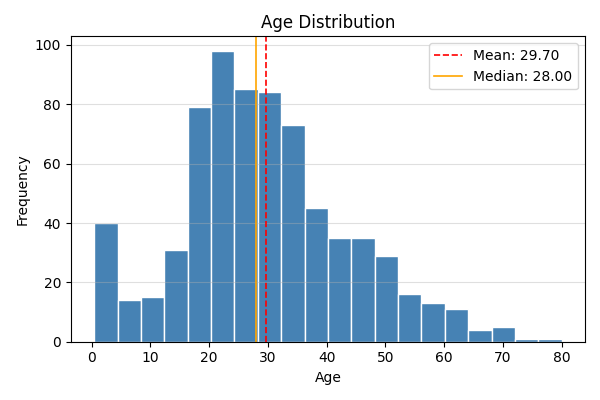
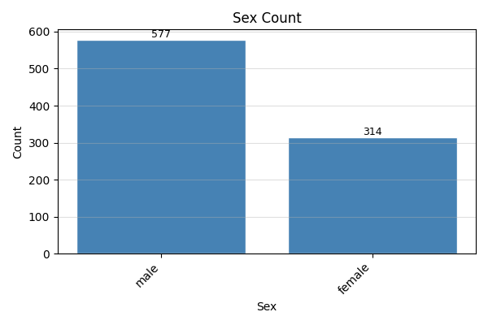
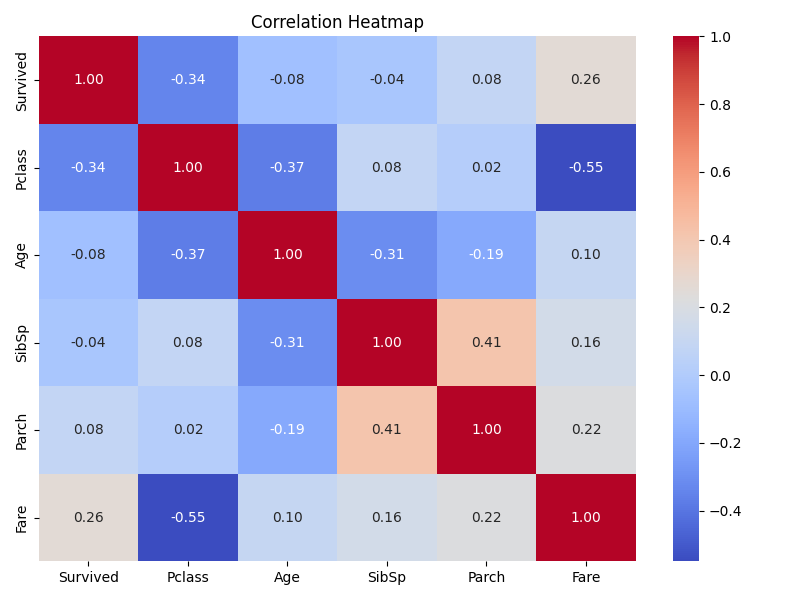

# csv-analyzer

A Python CLI tool for automatic CSV analysis and visualization.

## Features

- CSV loading with pandas
- Basic statistics analysis
- Automatic analysis comments
- Histogram generation
- Correlation heatmap generation

## Technologies

- Python
- pandas
- matplotlib
- seaborn
- argparse

## Setup

```bash
git clone git@github.com:a9307781-cpu/csv-analyzer.git
cd csv-analyzer

python3 -m venv venv
source venv/bin/activate

pip install -r requirements.txt
```

## Usage

```bash
python analyzer.py sample_data/titanic.csv
```

## Example Output

```
=== Basic Statistics ===

Age
平均: 29.70
中央値: 28.00

📝 Analysis
平均値が中央値より大きいため、右裾が長い分布の可能性があります。
```

## Demo Images

### Histogram



### Bar Chart



### Heatmap


